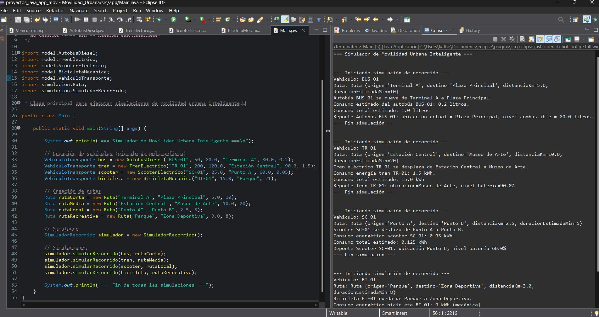
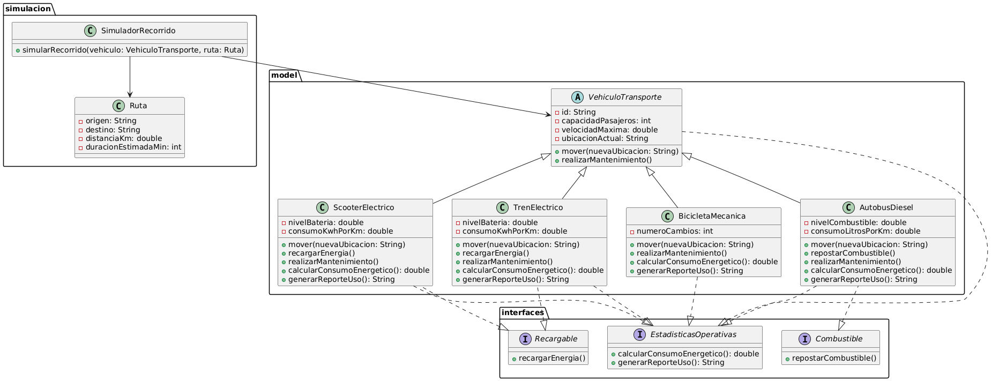

**_<h1 align="center">:vulcan_salute: Titulo proyecto :computer:</h1>_**

**<h3>:blue_book: Contexto:</h3>**

- Considere el caso de una microempresa, la cual está buscando desarrollar La ciudad de Technópolis está implementando un sistema de movilidad urbana inteligente con el objetivo de integrar y automatizar los distintos medios de transporte.
- El nuevo sistema debe permitir registrar, simular recorridos, calcular consumo de energía y gestionar mantenimiento de una variedad de vehículos.
- La solución debe estar basada en una arquitectura orientada a objetos que facilite la escalabilidad, mantenibilidad y reutilización del código a futuro, incorporando principios de diseño sólidos.
- La empresa encargada de desarrollar este sistema ha decidido confiar esta primera versión a tu equipo, con el objetivo de generar una solución funcional que pueda ser fácilmente extendida para incluir nuevas funcionalidades y tipos de transporte en el futuro.

**<h3>:orange_book: Objetivo de Aprendizaje:</h3>**

- Utilizar principios básicos de diseño orientado a objetos para implementar una solución en Java que utilice polimorfismo (por herencia e interfaces) y respete principios de cohesión, bajo acoplamiento y responsabilidad única en un sistema de baja complejidad que represente un entorno realista.

**<h3>:green_book: Requerimientos Específicos:</h3>**

1. Modelo de clases y herencia
- Crear una clase abstracta VehiculoTransporte que contenga al menos los siguientes atributos:
    - id (String)
    - capacidadPasajeros (int)
    - velocidadMaxima (double)
    - ubicacionActual (String)
- Incluir métodos abstractos como:
    - mover(String nuevaUbicacion)
    - realizarMantenimiento()
- Crear al menos cuatro clases concretas que hereden de VehiculoTransporte:
    - AutobusDiesel
    - TrenElectrico
    - ScooterElectrico
    - BicicletaMecanica
- Cada clase debe implementar sus propias versiones de mover y realizarMantenimiento, con lógicas diferentes según el tipo de transporte.

2. Interfaces y polimorfismo
- Crear una interfaz Recargable con el método recargarEnergia(), implementada por los vehículos eléctricos.
- Crear una interfaz Combustible con el método repostarCombustible(), implementada por los vehículos a gasolina o diésel.
- Crear una interfaz EstadisticasOperativas con métodos como calcularConsumoEnergetico(), generarReporteUso(), implementada por todos los vehículos.

3. Uso de clases auxiliares y composición
- Crear una clase Ruta que represente un recorrido urbano, con atributos como origen, destino, distanciaKm, duracionEstimadaMin.
- Crear una clase SimuladorRecorrido que reciba vehículos y rutas, y que simule el movimiento de los vehículos, registrando el consumo y actualizando la ubicación.

4. Principios de diseño orientado a objetos
- Aplicar explícitamente los siguientes principios:
    - Responsabilidad Única (SRP): justificar en el código cómo cada clase tiene una única razón para cambiar.
    - Bajo acoplamiento y alta cohesión: diseñar clases que se comuniquen mediante interfaces y tengan funcionalidades bien definidas.
    - Reutilización: diseñar componentes (interfaces y clases abstractas) que permitan incorporar nuevos vehículos sin modificar el código existente.

5. Representación visual
- Crear un diagrama de clases UML que represente:
    - Herencia y uso de interfaces.
    - Relaciones de composición entre clases.
    - Métodos sobrescritos o polimórficos.

6. Simulación de casos de uso
- Implementar un programa principal (main) donde:
    - Se cree un conjunto de vehículos variados.
    - Se creen rutas urbanas.
    - Se asigne cada vehículo a una ruta.
    - Se simule su movimiento, consumo de energía o combustible y se genere un reporte final con el resumen del recorrido.

**<h3>:book: Ejemplo de Salida:</h3>**

**<h3>:book: Diagrama UML del sistema:</h3>**

